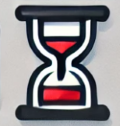
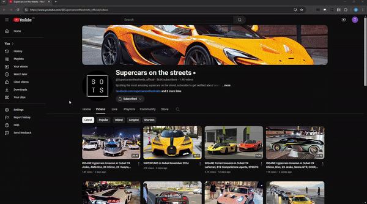
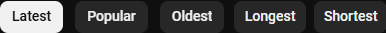
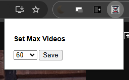

<p align="center">
  
</p>

<h1 align="center">YouTube Duration Sorter</h1>

<p align="center">
  Sort YouTube videos by duration with just one click! 🎬
</p>

<p align="center">
  
  
  
  
</p>

---

<p align="center">
  
</p>

---

## 📋 Table of Contents
- [About](#about)
- [Features](#features)
- [Installation](#installation)
- [How to Use](#how-to-use)
- [Screenshots](#screenshots)
- [License](#license)

## 🎯 About
YouTube Duration Sorter is a Chrome extension that enhances your YouTube browsing experience by adding the ability to sort videos by duration. Whether you're looking for quick clips or long-form content, this extension makes it easy to find exactly what you want.

**Tags**: `youtube-tools`, `video-sorting`, `chrome-extension`, `javascript`, `productivity`, `content-filtering`, `youtube-enhancement`, `duration-sort`

## ✨ Features
- **Quick Duration Sorting**: Sort videos by longest or shortest duration
- **Seamless Integration**: Buttons match YouTube's native UI design
- **Smart Loading**: Automatically loads more videos when needed
- **One-Click Revert**: Easily return to the original video order
- **Smooth Animations**: Loading indicators for better user experience
- **Configurable**: Customize the number of videos to sort

## 💻 Installation
To install the extension locally:

1. Clone this repository:
   ```bash
   git clone https://github.com/bmotana1/youtube-duration-sorter.git

2. Open Chrome and navigate to chrome://extensions/
3. Enable "Developer mode" in the top right corner
4. Click "Load unpacked" and select the extension directory

## 🚀 How to Use
1. Navigate to any YouTube page with multiple videos (search results, playlist, channel)
2. Look for the new "Longest" and "Shortest" buttons next to YouTube's filter chips
3. Click either button to sort videos by duration
4. Use the "Revert" button to return to the original order
5. Videos will automatically load as you scroll
## 📸 Screenshots
<p align="center">

<br>
<br>

</p>

## 📄  License
This project is licensed under the MIT License - see the LICENSE file for details.
<br>
<br>
<br>
<br>
<p align="center">
  Made with ❤️ for YouTube power users
</p>
